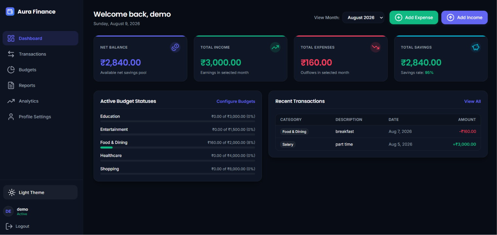
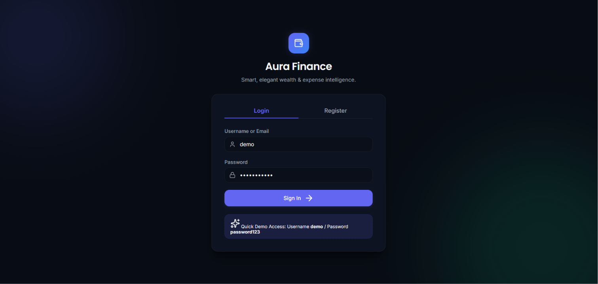
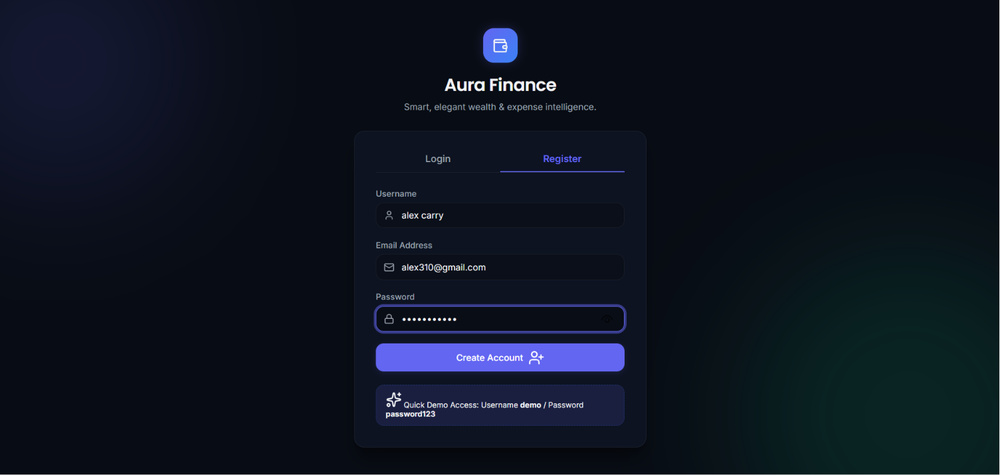
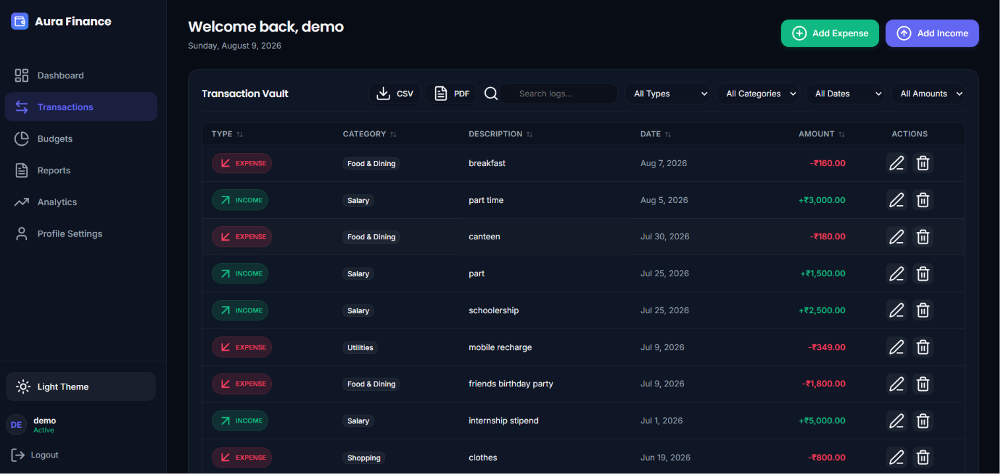
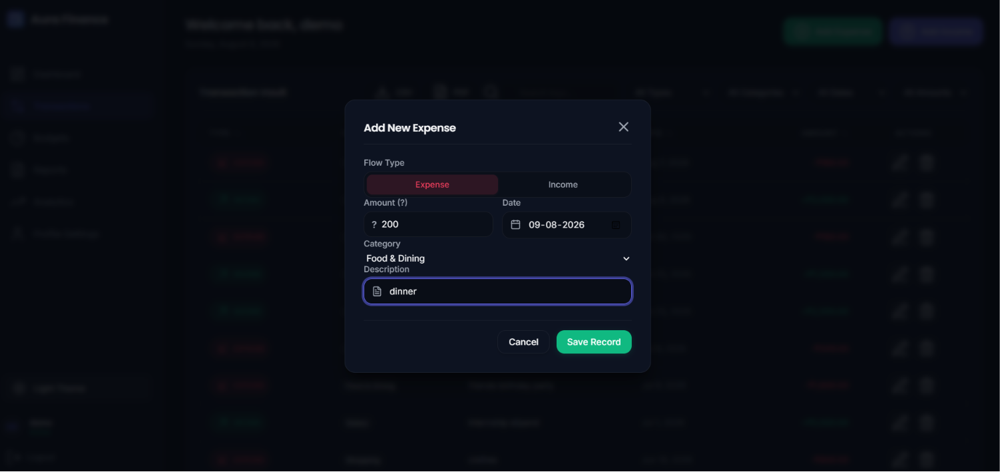
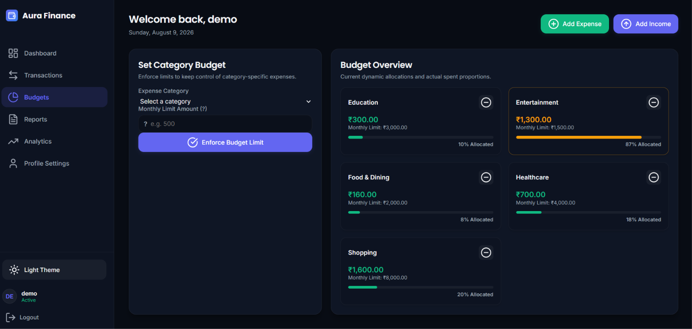
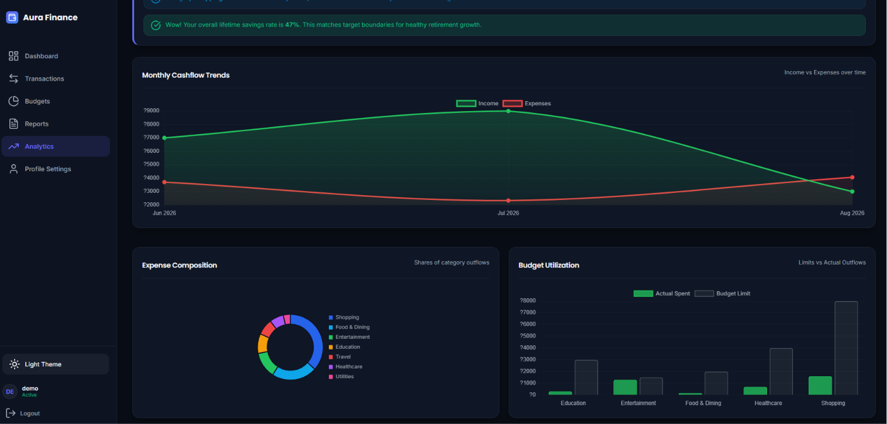

# 💰 Aura Finance — Personal Expense Tracker

> **A modern, secure, and intuitive personal finance management application** built to help users track income, manage expenses, set budgets, and understand their financial habits through interactive analytics.

**Aura Finance** is a full-stack personal expense tracking application built with **Node.js, Express, MongoDB, and JavaScript**. It provides an easy-to-use dashboard where users can manage their transactions, monitor budgets, and visualize their financial activity.

---

## 📸 Project Preview

<!-- Add your main dashboard screenshot here -->

<p align="center">
  
</p>

> 📌 **Recommended image:** Add a screenshot of your main dashboard here showing the balance, income, expenses, budgets, charts, and recent transactions.

---

## ✨ Features

### 🔐 User Authentication

* User registration
* Secure login system
* Password hashing using `bcryptjs`
* Session-based authentication
* Logout functionality
* Authenticated user profile management

### 💸 Transaction Management

Users can manage their complete financial activity:

* Add income
* Add expenses
* Edit transactions
* Delete transactions
* View transaction history
* Categorize transactions
* Track transaction dates
* Add descriptions/notes

### 📊 Financial Dashboard

Aura Finance provides a centralized dashboard containing:

* 💰 Total Income
* 💸 Total Expenses
* 📈 Net Balance
* 🎯 Budget Status
* 📊 Category-wise Expense Breakdown
* 📅 Monthly Income & Expense Trends
* 🧾 Recent Transactions

### 🎯 Budget Management

Users can create and manage budgets for different categories.

For example:

| Category         | Monthly Budget | Spending |
| ---------------- | -------------: | -------: |
| 🍔 Food          |         ₹5,000 |   ₹3,200 |
| 🚗 Transport     |         ₹3,000 |   ₹2,100 |
| 🛍️ Shopping     |         ₹4,000 |   ₹4,500 |
| 🎬 Entertainment |         ₹2,000 |   ₹1,200 |

The dashboard helps users understand whether they are staying within their planned spending limits.

### 📈 Financial Analytics

Aura Finance converts transaction data into useful visual information.

Analytics include:

* Expense distribution by category
* Monthly income trends
* Monthly expense trends
* Income vs. expense comparison
* Budget utilization
* Overall financial balance

---

# 🖼️ Screenshots

You can create a `screenshots` folder inside your project and place your screenshots there.

```text
screenshots/
├── dashboard.png
├── login.png
├── register.png
├── transactions.png
├── add-transaction.png
├── budgets.png
├── analytics.png
└── profile.png
```

### 1. 🔐 Login Page

<!-- Add login screenshot -->

<p align="center">
  
</p>

**What to show:**
Your login form with username/email and password fields.

---

### 2. 📝 Registration Page

<!-- Add registration screenshot -->

<p align="center">
  
</p>

**What to show:**
The registration form and account creation interface.

---

### 3. 📊 Dashboard

<!-- Add dashboard screenshot -->

<p align="center">
  
</p>

**This is the most important screenshot.**

Try to show:

* Total balance
* Total income
* Total expenses
* Budget status
* Expense chart
* Monthly trend chart
* Recent transactions

---

### 4. 💳 Transaction Management

<!-- Add transaction screenshot -->

<p align="center">
  
</p>

**What to show:**

* Transaction list
* Income/expense indicators
* Categories
* Dates
* Edit/delete actions

---

### 5. ➕ Add Transaction

<!-- Add add transaction screenshot -->

<p align="center">
  
</p>

**What to show:**

The form used to add a new income or expense.

---

### 6. 🎯 Budget Management

<!-- Add budget screenshot -->

<p align="center">
  
</p>

**What to show:**

* Budget categories
* Spending limits
* Current spending
* Remaining budget
* Budget progress/status

---

### 7. 📈 Analytics

<!-- Add analytics screenshot -->

<p align="center">
  
</p>

**What to show:**

* Category expense breakdown
* Monthly trends
* Income vs. expense charts

---

# 🏗️ System Architecture

Aura Finance follows a simple full-stack architecture:

```text
                    ┌─────────────────────┐
                    │      User           │
                    └──────────┬──────────┘
                               │
                               ▼
                    ┌─────────────────────┐
                    │   Frontend          │
                    │ HTML / CSS / JS     │
                    └──────────┬──────────┘
                               │
                         HTTP / REST API
                               │
                               ▼
                    ┌─────────────────────┐
                    │   Express Server     │
                    │     Node.js          │
                    └──────────┬──────────┘
                               │
                  ┌────────────┴────────────┐
                  │                         │
                  ▼                         ▼
          Authentication              API Routes
          & Sessions                  & Business Logic
                  │                         │
                  └────────────┬────────────┘
                               │
                               ▼
                    ┌─────────────────────┐
                    │      MongoDB         │
                    │     Database         │
                    └─────────────────────┘
```

---

# 🛠️ Tech Stack

## Frontend

* HTML5
* CSS3
* JavaScript
* Responsive UI
* Charts / Data Visualization

## Backend

* Node.js
* Express.js

## Database

* MongoDB
* Mongoose

## Authentication & Security

* bcryptjs
* express-session
* Environment variables using dotenv

---

# 📂 Project Structure

```text
Aura-Finance/
│
├── public/
│   ├── index.html
│   ├── app.js
│   └── style.css
│
├── server.js
├── database.js
├── seed.js
├── package.json
├── package-lock.json
├── .env
├── .gitignore
└── README.md
```

### Important Files

| File                | Description                                   |
| ------------------- | --------------------------------------------- |
| `server.js`         | Main Express server and API routes            |
| `database.js`       | MongoDB connection and database models        |
| `seed.js`           | Creates demo users, budgets, and transactions |
| `public/index.html` | Main frontend structure                       |
| `public/app.js`     | Frontend functionality and API interaction    |
| `public/style.css`  | Application styling                           |
| `package.json`      | Project dependencies and scripts              |
| `.env`              | Environment configuration                     |

---

# ⚙️ How It Works

### 1. User Registration

A new user creates an account.

```text
User
 ↓
Registration Form
 ↓
Express API
 ↓
Password Hashing
 ↓
MongoDB
 ↓
Account Created
```

### 2. User Login

```text
Username + Password
        ↓
Authentication
        ↓
Password Verification
        ↓
Session Created
        ↓
Dashboard
```

### 3. Expense Tracking

```text
User adds transaction
        ↓
Frontend sends API request
        ↓
Express validates request
        ↓
MongoDB stores transaction
        ↓
Dashboard updates
```

### 4. Analytics

Transaction data is processed to calculate:

```text
Income
Expense
   ↓
Database
   ↓
Aggregation / Calculation
   ↓
Financial Statistics
   ↓
Charts & Dashboard
```

---

# 🚀 Getting Started

## Prerequisites

Before running Aura Finance, make sure you have:

* **Node.js** installed
* **npm** installed
* **MongoDB** running locally or a MongoDB connection string
* A modern web browser

---

## 1️⃣ Clone the Repository

```bash
git clone https://github.com/YOUR-USERNAME/aura-finance.git
```

Navigate to the project:

```bash
cd aura-finance
```

---

## 2️⃣ Install Dependencies

```bash
npm install
```

---

## 3️⃣ Configure Environment Variables

Create a `.env` file in the project root:

```env
MONGODB_URI=mongodb://127.0.0.1:27017/expense_tracker
SESSION_SECRET=your-session-secret
PORT=3000
```

### Environment Variables

| Variable         | Description                        |
| ---------------- | ---------------------------------- |
| `MONGODB_URI`    | MongoDB database connection string |
| `SESSION_SECRET` | Secret used for session management |
| `PORT`           | Port on which the server runs      |

> ⚠️ Never commit your `.env` file to GitHub.

Add it to `.gitignore`:

```text
.env
node_modules/
```

---

# 🌱 Seed Demo Data

Aura Finance includes a demo data seeding script.

Run:

```bash
npm run seed
```

This creates:

* Demo user
* Sample transactions
* Sample budgets

### Demo Credentials

```text
Username: demo
Password: password123
```

> ⚠️ These credentials are intended only for local/demo evaluation. Do not use them in production.

---

# ▶️ Run the Application

Start the application:

```bash
npm start
```

The application will run at:

```text
http://localhost:3000
```

Open the URL in your browser.

---

# 🔌 API Documentation

## Authentication

### Register

```http
POST /api/auth/register
```

Creates a new user account.

---

### Login

```http
POST /api/auth/login
```

Authenticates the user and starts a session.

---

### Get Current User

```http
GET /api/auth/me
```

Returns the currently authenticated user.

---

### Update Profile

```http
PUT /api/auth/profile
```

Updates user profile information.

---

### Logout

```http
POST /api/auth/logout
```

Ends the current user session.

---

# 💳 Transaction APIs

### Get Transactions

```http
GET /api/transactions
```

Returns transactions belonging to the authenticated user.

### Create Transaction

```http
POST /api/transactions
```

Creates a new income or expense transaction.

### Update Transaction

```http
PUT /api/transactions/:id
```

Updates an existing transaction.

### Delete Transaction

```http
DELETE /api/transactions/:id
```

Deletes a transaction.

---

# 🎯 Budget APIs

### Get Budgets

```http
GET /api/budgets
```

Returns user budgets.

### Create / Update Budget

```http
POST /api/budgets
```

Creates or updates a budget.

### Delete Budget

```http
DELETE /api/budgets/:id
```

Deletes a budget.

---

# 📊 Analytics APIs

### Summary

```http
GET /api/stats/summary
```

Returns:

* Total income
* Total expenses
* Net balance
* Budget status

### Category Breakdown

```http
GET /api/stats/category-breakdown
```

Returns expense totals grouped by category.

### Monthly Trends

```http
GET /api/stats/monthly-trends
```

Returns monthly income and expense trends.

---

# 🔒 Security

Aura Finance implements several basic security practices:

* Password hashing using `bcryptjs`
* Session-based authentication
* Environment variables for sensitive configuration
* User-specific transaction access
* Authentication checks for protected API routes
* MongoDB-based data persistence

### Production Considerations

For production deployment, consider adding:

* HTTPS
* Secure session cookies
* Persistent session store
* Rate limiting
* CSRF protection
* Input validation
* MongoDB Atlas
* Proper error logging
* Security headers
* Stronger password policies

---

# 📱 Responsive Design

Aura Finance is designed to provide a clean experience across different screen sizes.

Recommended screenshots:

```text
Desktop Dashboard
        ↓
Mobile Dashboard
        ↓
Mobile Transactions
```

### 📸 Recommended Mobile Screenshot

If your application is responsive, add:

```text
screenshots/mobile-dashboard.png
```

and include it in this section.

---

# 🧪 Demo / Testing

You can quickly evaluate the application using the seeded demo account.

```text
Username: demo
Password: password123
```

After logging in, explore:

1. Dashboard
2. Transactions
3. Add Expense
4. Add Income
5. Budgets
6. Analytics
7. Profile
8. Logout

---

# 🎥 Demo Video

A short demo video can make your GitHub project much more impressive.

You can upload a demo video to:

* YouTube
* GitHub repository
* LinkedIn

Then add it here.

Example:

```markdown
## 🎥 Project Demo

[▶️ Watch Aura Finance Demo](YOUR_VIDEO_LINK)
```

### 🎬 What to show in the video

Keep the video around **1–3 minutes**:

```text
Login
 ↓
Dashboard
 ↓
Add Expense
 ↓
Add Income
 ↓
Create Budget
 ↓
View Analytics
 ↓
Edit/Delete Transaction
 ↓
Logout
```

---

# 💡 Use Cases

Aura Finance can be useful for:

* 👨‍🎓 Students managing monthly expenses
* 👨‍💼 Working professionals
* 🏠 Individuals managing household expenses
* 💰 Personal budgeting
* 📊 Financial habit tracking
* 📈 Understanding spending patterns

---

# 🔮 Future Improvements

Possible future features include:

* 📱 Progressive Web App (PWA)
* 📥 Export reports as PDF
* 📊 Advanced financial analytics
* 🔔 Budget limit notifications
* 💱 Multiple currency support
* 🌙 Light/Dark theme
* 📅 Custom date-range reports
* 📧 Monthly financial reports via email
* ☁️ Cloud deployment
* 📱 Mobile application
* 🤖 AI-powered spending insights
* 🔮 Expense prediction
* 💡 Personalized saving recommendations
* 🔐 Two-factor authentication
* 📈 Investment tracking

---

# 🤖 Future AI Features

One of the potential improvements for Aura Finance is integrating AI to provide personalized financial insights.

For example:

> "Your food expenses increased by 18% compared to last month."

or:

> "You are approaching your entertainment budget. Consider limiting spending for the remaining days of this month."

This could transform Aura Finance from a simple expense tracker into an **AI-powered personal finance assistant**.

---

# 📊 Example Dashboard Flow

```text
                    AURA FINANCE
                         │
          ┌──────────────┼──────────────┐
          │              │              │
        Income         Expense        Balance
          │              │              │
          └──────────────┼──────────────┘
                         │
                    Transactions
                         │
              ┌──────────┴──────────┐
              │                     │
           Budgets               Analytics
              │                     │
              └──────────┬──────────┘
                         │
                  Financial Insights
```

---

# 🌟 Why Aura Finance?

Managing personal finances can become difficult when transactions are spread across multiple applications, notes, or spreadsheets.

**Aura Finance brings everything together in one place.**

It allows users to:

> **Track → Analyze → Budget → Improve**

The goal is to make financial management **simple, visual, and accessible**.

---

# 🧠 Learning Outcomes

This project helped demonstrate practical knowledge of:

* Full-stack web development
* REST API development
* Node.js
* Express.js
* MongoDB
* Mongoose
* CRUD operations
* User authentication
* Session management
* Password hashing
* Frontend/backend communication
* Data visualization
* Database design
* Environment configuration
* Git and GitHub

---

# 📌 Project Information

| Information           | Details                  |
| --------------------- | ------------------------ |
| **Project Name**      | Aura Finance             |
| **Project Type**      | Personal Expense Tracker |
| **Frontend**          | HTML, CSS, JavaScript    |
| **Backend**           | Node.js, Express.js      |
| **Database**          | MongoDB                  |
| **ODM**               | Mongoose                 |
| **Authentication**    | Session-based            |
| **Password Security** | bcryptjs                 |
| **Configuration**     | dotenv                   |
| **License**           | ISC                      |

---

# 👨‍💻 Developer

### Jay Rohit

B.Tech Student | Full-Stack & Software Development Enthusiast

📧 **Email:** [jayrohit0310@gmail.com](mailto:jayrohit0310@gmail.com)

---

# 📬 Contact

If you have suggestions, feedback, or questions regarding Aura Finance, feel free to contact me:

**Email:** [jayrohit0310@gmail.com](mailto:jayrohit0310@gmail.com)
**Email:** [Jayrohit0310](mailto:https://www.linkedin.com/in/jay-rohit-8204ab320?utm_source=share_via&utm_content=profile&utm_medium=member_android)

You can also open an issue in this repository for bugs, feature requests, or improvements.

---

# ⭐ Support

If you found **Aura Finance** useful or interesting:

⭐ Star this repository
🍴 Fork the repository
🐛 Report issues
💡 Suggest new features
📢 Share the project

Your support is appreciated!

---

# 📄 License

This project is licensed under the **ISC License**.

---

<p align="center">
  Made with ❤️ by <strong>Jay Rohit</strong>
</p>

<p align="center">
  💰 <strong>Aura Finance — Track Your Money. Understand Your Spending. Build Better Financial Habits.</strong>
</p>
